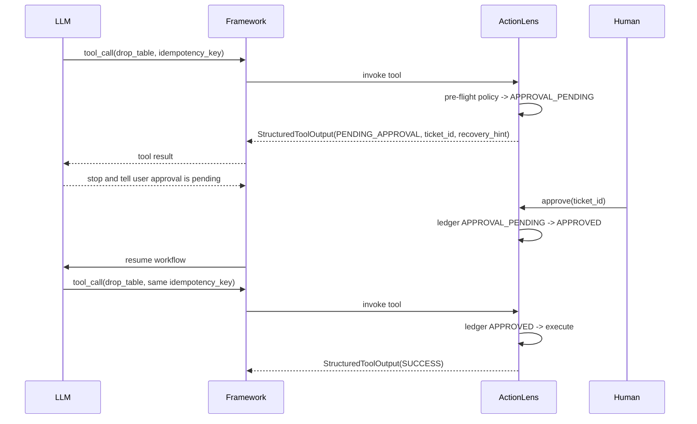

# ActionLens Python 第三方库工程设计细化

> 状态：实现前设计稿  
> 日期：2026-06-21  
> 输入依据：`report/plan.md`、`report/chat_pipeline.py`、`report/agent-runtime-practice-playbook-2026.md`、`report/harness-engineering-report-2026.md`、`report/harness-practice-playbook-2026.md`  

## 1. 结论先行

ActionLens 应实现为一个**跨 Agent 框架的 Python 工具治理与轨迹采集库**。它不编排 agent，不替代 LangGraph、PydanticAI、AutoGen、CrewAI、OpenAI Agents SDK 或自研 runtime，而是包在工具调用边界上，提供下面四类稳定能力：

1. **工具执行治理**：参数规范化、权限/策略判定、幂等防重放、超时、异常分类、审批挂起。
2. **LLM 友好输出**：不把原始 Python 异常和巨大结果直接塞回模型，而是返回结构化状态、摘要、artifact 引用和恢复提示。
3. **轨迹协议落盘**：用版本化 `jsonl` 记录工具调用、策略决策、错误、artifact、耗时和幂等命中，作为生产复盘与 harness 数据源。
4. **离线消费接口**：提供 CLI 和 exporter，把 ActionLens 轨迹转成 Inspect AI / SFT / 自研 eval 可读的数据。SWE-bench 类 patch 导出只在具备代码文件操作语义时支持。

MVP 不做完整 agent runtime，不做通用 sandbox，不做大而全 dashboard，不默认引入云观测或重依赖。第一版要让现有 Python 项目用一个装饰器或包装函数就能接入，并且在热路径上保持低开销。

落地时先收敛成四个实现原语：`ToolSpec` 声明治理元数据，`ToolRuntime` 执行拦截链，`EventSink` 记录轨迹，`ArtifactStore` 管理大对象。`ActionLens` 只是这些原语的用户友好门面，不应演化成新的 agent 框架。

## 2. 背景与设计判断

### 2.1 来自计划的核心目标

`report/plan.md` 已经把 ActionLens 定位为 Agent 编排层与底层 API 之间的 data plane / control plane。这个判断是正确的，原因是当前 agent 工程最大的不稳定点经常发生在工具边界：

- 模型重复调用非幂等写操作。
- 工具抛出原始异常，模型只能盲目重试。
- 工具返回超大 HTML、日志、图片解析结果，污染上下文窗口。
- 生产运行没有标准化轨迹，后续无法回放、评测、统计或训练。
- HITL 审批只在 UI 层短暂停顿，没有进入可恢复协议。

ActionLens 的最小可行价值不是“更多框架功能”，而是把这些风险转成**确定的工具调用协议**。

### 2.2 来自 `chat_pipeline.py` 的可复用思想

`report/chat_pipeline.py` 是业务实现，不应整体搬进库。但其中有几类工程习惯非常值得抽象：

- **ContextVar 隔离运行上下文**：`_chat_req_ctx`、`_chat_images_ctx`、`_tool_results_cache` 避免把请求对象直接作为工具参数暴露给 LLM。ActionLens 应用 `ContextVar` 承载 `session_id`、`run_id`、`actor_id`、trace metadata。
- **工具结果缓存与详情延迟拉取**：`get_tool_detail()` + `_tool_results_cache` 的思想说明，大结果应先摘要返回，原始结果保留为 artifact 或缓存引用，按需读取。
- **字段裁剪与上下文减毒**：`_prune_task_fields()`、`_truncate_text()` 体现了“模型可见输出”和“系统记录输出”必须隔离。
- **进度事件**：`progress_service.emit(... START/COMPLETED ...)` 是可视化和监测的基础。ActionLens 应把这类事件固化成 sink 协议。
- **异步回调**：`_fire_tool_callback()` 使用 HMAC 签名把工具结果推给外部系统，适合后续抽成 `CallbackSink`，但不应进入核心依赖。
- **远程任务监测**：HTTP invoke + WebSocket streaming + polling fallback 的模式适合后续 `RemoteToolRunner`，用于包装长任务服务，而不是放进第一版核心。
- **工具门控与参数改写**：图片选择逻辑在工具执行前对参数做强约束，说明 pre-flight policy 不只是 allow/deny，也需要支持 modify args。
- **并发工具执行**：`asyncio.gather()` 能提高效率，但需要声明哪些工具可并发、哪些工具不可并发。ActionLens 至少要在 `ToolSpec` 中表达并发安全属性。
- **执行预算**：业务管线中的递归/循环上限说明工具治理还需要 session 级 budget，防止模型在同一轮里无限调用工具。

### 2.3 来自 harness 报告的边界

`report/harness-engineering-report-2026.md` 对 harness 的定义是：

```text
task loading + environment reset + execution loop + trajectory/log + scorer/grader + replay/retry + failure classification
```

ActionLens 不是完整 harness。它只负责其中的**trajectory/log、failure classification、部分 replay 输入、部分 execution governance**。任务加载、环境重置、scorer/grader 应保持在外部 harness 或上层应用中。这样边界更清晰，也更容易被不同框架采用。

## 3. 非目标

第一阶段明确不做：

- 不实现 Agent 编排 DSL，不定义 graph、crew、swarm、planner。
- 不替代 LangSmith、Logfire、OpenTelemetry Collector、Prometheus 或 Inspect View。
- 不承诺通用代码 sandbox。ActionLens 可记录 sandbox 结果、连接外部 sandbox，但不内置跨平台隔离执行环境。
- 不默认使用 LLM 对工具结果做摘要。MVP 摘要必须是确定性、低成本、可预测的。
- 不把所有生产原始数据无条件落盘。隐私、密钥和大对象必须经过 redaction 与 artifact policy。
- 不把 SWE-bench 导出作为泛化承诺。只有接入代码编辑工具并能提取 patch 时才导出 SWE-bench 风格 artifact。
- 不承诺 `ContextVar` 在分布式 resume 场景中自动恢复。跨进程、跨机器恢复必须依赖显式上下文传递或上层框架状态。

## 4. 目标用户与接入方式

### 4.1 目标用户

- 已有 LangGraph / LangChain / PydanticAI / OpenAI Agents SDK / 自研 agent runtime 的团队。
- 有工具调用、审批、轨迹复盘、失败分类和离线评测需求的 AI 应用团队。
- 需要在不重写业务工具的前提下，为高风险工具补上幂等、防重试、结构化错误和可观测性的工程团队。

### 4.2 接入形态

ActionLens 需要支持三层接入，从低侵入到深集成：

1. **纯 Python 装饰器**：对普通 sync / async callable 生效。
2. **通用包装器**：对已经存在的工具对象或函数做 `wrap()`。
3. **框架适配器**：对 LangChain tool、PydanticAI toolset 等做薄适配，尽量只依赖 optional extra。

示例 API：

```python
import actionlens as al

lens = al.ActionLens(
    project="nutrition-agent",
    storage_dir=".actionlens",
)

@lens.tool(
    name="execute_sql_mutation",
    risk=al.RiskLevel.MUTATION,
    idempotency=al.IdempotencyPolicy.REQUIRED,
    timeout_sec=30,
    output=al.OutputPolicy(max_inline_bytes=4096),
)
async def execute_sql_mutation(query: str) -> dict:
    return await db.execute(query)

async with lens.session(session_id="chat-123", actor_id="user-42"):
    output = await execute_sql_mutation("update ...")
```

框架集成示例：

```python
from actionlens.integrations.langchain import wrap_langchain_tool

safe_tool = wrap_langchain_tool(
    raw_tool,
    lens=lens,
    spec=al.ToolSpec(risk=al.RiskLevel.EXTERNAL_IO),
)
```

## 5. 核心抽象

### 5.1 四个实现原语

ActionLens 的代码结构应优先围绕四个原语组织：

| 原语 | 解决的问题 | MVP 要求 |
| --- | --- | --- |
| `ToolSpec` | 工具风险、幂等、超时、并发、输出策略的声明 | 可序列化、可进入事件 |
| `ToolRuntime` | 包装 callable，执行 pre-flight / execution / post-flight | 支持 sync / async，不绑定框架 |
| `EventSink` | 轨迹与治理事件落盘 | `MemorySink` + `JsonlSink` |
| `ArtifactStore` | 大对象、原始结果、截断结果的引用化存储 | 本地文件 store |

`Policy`、`Ledger`、`Exporter`、`FrameworkAdapter` 都是围绕这四个原语展开的扩展点。

### 5.2 `ActionLens`

进程内主入口，负责持有配置、policy chain、ledger、artifact store、trajectory sink 和 framework adapters。

职责：

- 注册/包装工具。
- 提供 session context。
- 管理 sink 生命周期和 flush。
- 暴露 CLI/exporter 所需的默认路径约定。
- 创建默认 `ToolRuntime` 并把 `@lens.tool` 转发给 runtime。

不职责：

- 不管理模型调用循环。
- 不决定 agent 下一步该做什么。
- 不替代业务认证、数据库事务或 sandbox。

### 5.3 `ToolRuntime`

工具执行内核，负责把一个 callable 变成受治理的 callable。

职责：

- 保存原始函数与 `ToolSpec`。
- 在调用时构造 `ToolCallContext`。
- 按固定顺序执行 policy、ledger、timeout、error mapping、output policy、event sink。
- 对外提供单工具 `invoke()` 和批量工具 `invoke_many()`。

不职责：

- 不决定模型是否应该调用该工具。
- 不负责环境 reset、scorer 或模型 retry。
- 不在核心层依赖具体 agent 框架的消息类型。

### 5.4 `ToolSpec`

工具治理元数据。应设计为稳定、可序列化、可出现在轨迹里。

```python
class ToolSpec(BaseModel):
    name: str
    description: str | None = None
    risk: RiskLevel = RiskLevel.READ
    idempotency: IdempotencyPolicy = IdempotencyPolicy.OFF
    idempotency_key_param: str = "idempotency_key"
    hash_ignore_keys: list[str] = []
    timeout_sec: float | None = None
    concurrency: ConcurrencyPolicy = ConcurrencyPolicy.UNKNOWN
    approval: ApprovalPolicy | None = None
    output: OutputPolicy = OutputPolicy()
    tags: dict[str, str] = {}
    schema_version: str = "actionlens.tool.v1"
```

关键枚举建议：

- `RiskLevel.READ`：纯读，无副作用。
- `RiskLevel.EXTERNAL_IO`：访问外部网络、搜索、第三方服务，通常可重试但要记录成本。
- `RiskLevel.MUTATION`：写数据库、写文件、发消息、下单、调用会产生业务副作用的 API。
- `RiskLevel.DESTRUCTIVE`：删除、覆盖、付款、权限变更等强风险操作。

- `IdempotencyPolicy.OFF`：不检查。
- `IdempotencyPolicy.AUTO_HASH`：用 canonical args 自动生成 key。
- `IdempotencyPolicy.REQUIRED`：必须存在 `idempotency_key_fn` 或调用参数提供 key，否则 pre-flight 失败。
- `IdempotencyPolicy.CACHE_READ`：读工具可选缓存，不等同于写操作幂等保护。

幂等配置还必须支持：

- `idempotency_key_param`：默认暴露给框架 schema 的幂等键参数名。
- `hash_ignore_keys`：自动 hash 前剔除易变字段，例如 `timestamp`、`nonce`、`uuid`、`request_id`。
- `idempotency_key_fn`：后续版本提供的业务级 key 函数，用于订单、文件路径、patch hash 等真实操作身份。

### 5.5 `ToolCallContext`

一次工具调用的上下文，来自 `ContextVar`、框架 runtime 或手工传入。

```python
class ToolCallContext(BaseModel):
    project: str
    environment: str = "default"
    tenant_id: str | None = None
    session_id: str
    run_id: str
    call_id: str
    parent_call_id: str | None = None
    actor_id: str | None = None
    framework: str | None = None
    tool_name: str
    attempt: int = 0
    metadata: dict[str, Any] = {}
```

设计要点：

- `session_id` 用于会话级防重复和导出筛选。
- `run_id` 用于一次 agent run 或一次 eval sample。
- `call_id` 用于审批、恢复、事件关联。
- `tenant_id`、`environment` 用于区分生产/测试、多租户和资源作用域，避免幂等 key 误伤。
- `metadata` 必须可 redaction，不能默认把完整请求对象塞进去。

上下文获取优先级：

1. 显式传入的 `__al_ctx: ToolCallContext`。
2. 包装器调用时传入的 `context=` 关键字。
3. 当前进程的 `ContextVar` session。
4. 最后才生成匿名临时 context，并在事件里标记 `context_source="generated"`。

`ContextVar` 只适合单进程 request scope。LangGraph checkpoint、Temporal workflow、Celery task、Kubernetes worker resume 等分布式场景必须由上层框架把 `ToolCallContext` 序列化进状态，并在恢复时显式传给工具。`__al_ctx` 和 `context` 都不能暴露给 LLM schema。

### 5.6 `StructuredToolOutput`

模型可见输出，和系统轨迹严格分离。

```python
class StructuredToolOutput(BaseModel):
    schema_version: str = "actionlens.output.v1"
    status: Literal[
        "SUCCESS",
        "FAILED",
        "SKIPPED",
        "PENDING_APPROVAL",
        "DENIED",
        "TIMEOUT",
    ]
    result_summary: str
    result: Any | None = None
    artifact_refs: list[ArtifactRef] = []
    error_taxonomy: str | None = None
    recovery_hint: str | None = None
    governance: dict[str, Any] = {}
```

约束：

- `result` 必须受 `OutputPolicy` 限制，不能无上限塞入。
- 大对象进入 `artifact_refs`。
- `error_taxonomy` 面向程序分析，`recovery_hint` 面向 LLM 自修复。
- 对 LangChain 等框架可以序列化为 JSON 字符串，对 typed framework 可以保持 Pydantic/dict。

### 5.7 `TrajectoryEvent`

系统记录事件，是生产复盘和 harness exporter 的事实来源。

```python
class TrajectoryEvent(BaseModel):
    schema_version: str = "actionlens.event.v1"
    event_id: str
    timestamp: datetime
    project: str
    session_id: str
    run_id: str
    call_id: str | None = None
    sequence: int
    event_type: str
    phase: Literal["INSTRUMENT", "PRE_FLIGHT", "EXECUTION", "POST_FLIGHT", "EXPORT"]
    tool_name: str | None = None
    input_ref: ArtifactRef | None = None
    output_ref: ArtifactRef | None = None
    error: ErrorRecord | None = None
    decision: PolicyDecision | None = None
    metrics: dict[str, Any] = {}
    metadata: dict[str, Any] = {}
```

最小事件类型：

- `tool_call.started`
- `policy.decision`
- `idempotency.hit`
- `approval.pending`
- `tool_call.completed`
- `tool_call.failed`
- `artifact.created`
- `sink.dropped`
- `export.completed`

### 5.8 `ArtifactRef`

大对象和敏感对象不能直接塞进事件或 LLM 输出。

```python
class ArtifactRef(BaseModel):
    uri: str
    media_type: str
    size_bytes: int
    sha256: str
    preview: str | None = None
    redacted: bool = False
    created_at: datetime
    expires_at: datetime | None = None
```

MVP 只实现本地文件 artifact：

```text
.actionlens/
  artifacts/
    sha256-prefix/
      <sha256>.json
      <sha256>.txt
      <sha256>.bin
  trajectories/
    actionlens-YYYY-MM-DD.jsonl
  ledger/
    idempotency.sqlite3
```

ArtifactStore 必须具备清理机制：

- 每个 artifact 记录 `created_at`、`expires_at`、`size_bytes`。
- MVP 提供 `actionlens gc --older-than 7d`，按时间清理。
- 后续支持按项目目录总大小做 LRU 清理，例如 `max_bytes=10GB`。
- 清理命令只删除本地 artifact 文件和索引，不改写历史 JSONL；历史事件中的 `ArtifactRef` 可以变成 dangling ref，report/exporter 需要能显示“artifact 已清理”。

## 6. 调用生命周期

ActionLens 的工具执行分为四段：Instrument、Pre-flight、Execution、Post-flight。

### 6.1 Instrument

开发者调用 `@lens.tool(...)` 或 `lens.wrap(...)` 时发生。

动作：

- 保存原始 callable。
- 用 `functools.wraps` 保留签名、docstring、name。
- 推断 sync / async。
- 注册 `ToolSpec`。
- 只做轻量准备，不打开 DB 长事务，不做网络调用。

设计要求：

- 包装后的函数仍可作为普通 Python 函数调用。
- 不强迫业务代码继承基类。
- optional framework adapter 不能污染核心包依赖。
- 包装器必须设置 `__signature__`，让 `inspect.signature()`、LangChain、OpenAI Agents SDK、PydanticAI 等 schema 提取器看到治理后的工具 schema。
- `__al_ctx`、`context` 等运行时参数必须从公开 signature 中隐藏。
- 当 `IdempotencyPolicy.REQUIRED` 且原函数没有 `idempotency_key` 参数时，公开 signature 应动态注入 `idempotency_key: str`，并在调用原函数前剥离。
- 若 argument rewrite 会固定、移除或限制某些参数，适配器层应同步调整 JSON Schema 描述；MVP 先支持 idempotency key 注入。

### 6.2 Pre-flight

模型或上层 runtime 已决定调用工具，但业务函数尚未执行。

执行顺序：

1. 绑定签名，生成 canonical args。
2. redaction 预处理，得到 `safe_args`。
3. 计算 `args_hash` 和候选 `idempotency_key`。
4. 运行 policy chain，得到 allow / deny / modify / pending approval。
5. 检查 idempotency ledger。
6. 写入 `tool_call.started`、`policy.decision`、`idempotency.hit` 等事件。

`PolicyDecision`：

```python
class PolicyDecision(BaseModel):
    action: Literal["ALLOW", "DENY", "MODIFY_ARGS", "PENDING_APPROVAL"]
    reason: str
    modified_args: dict[str, Any] | None = None
    approval_ticket: ApprovalTicket | None = None
    metadata: dict[str, Any] = {}
```

策略链要支持短路：

- `DENY` 直接返回 `StructuredToolOutput(status="DENIED")`。
- `PENDING_APPROVAL` 返回 `PENDING_APPROVAL`，并把 `approval_ticket` 写入事件和可选 ticket store。
- `MODIFY_ARGS` 使用修改后的参数继续，事件中同时保留 redacted before/after。

签名绑定必须使用“公开 signature + 隐藏 runtime kwargs”的双层模型：公开 signature 服务 LLM/tool schema，隐藏 runtime kwargs 服务框架恢复。执行前从调用参数中剥离 `__al_ctx`、`context`、内部 tracing 参数，避免污染业务函数和模型可见输出。

### 6.3 Execution

业务函数实际执行。

要求：

- async 工具使用 `asyncio.wait_for()` 或 anyio cancel scope 实现超时。
- sync 工具默认只能记录超时预算，不承诺强杀线程。若用户显式配置 `run_sync_in_thread=True`，可用线程池执行并在超时后返回 `TIMEOUT`，但底层线程无法可靠终止，这一点必须写进文档。
- 异常统一捕获并映射为 `ErrorRecord`，不把 traceback 原样返回给 LLM。
- 对 `KeyboardInterrupt`、`SystemExit` 等 BaseException 不做普通异常吞噬。

错误分类建议：

| taxonomy | 典型来源 | 默认 recovery_hint |
| --- | --- | --- |
| `ValidationError` | 参数缺失、类型错误、schema 校验失败 | 修正参数后重试，不要重复已成功的写操作 |
| `PermissionDenied` | policy 拒绝、高危操作未授权 | 不要绕过权限，向用户请求授权或改用只读方案 |
| `ApprovalRequired` | HITL 挂起 | 等待审批结果，不要重新发起相同操作 |
| `Timeout` | 工具执行超时 | 不要立即重复高成本调用，可缩小范围或换备用工具 |
| `NetworkError` | DNS、连接失败、HTTP transport | 可有限重试，记录 attempt |
| `RateLimited` | 429、配额限制 | 等待或降级，不要并发重试 |
| `FormatError` | JSON/XML/结构化解析失败 | 请求更小或更明确的输出格式 |
| `Conflict` | 乐观锁、版本冲突、重复资源 | 读取最新状态后再决定 |
| `ResourceExhausted` | 内存、磁盘、上下文过大 | 减少输入或改用 artifact |
| `UnknownError` | 未分类异常 | 保守停止，交给人工或上层 retry policy |

### 6.4 Streaming / AsyncGenerator 预留

MVP 可以先不完整支持流式工具，但接口设计不能堵死 `AsyncGenerator`：

- 如果工具返回 async generator，`ToolRuntime` 应能识别并转为 chunked interception 模式。
- chunk 直接追加写入 artifact 或 stream sink，内存里只保留最后 N 行或 N KB。
- 模型可见输出可以周期性返回 progress event，最终返回 `StructuredToolOutput`。
- 对 bash stdout、长网页抓取、远程 job stream、流式 LLM 工具，不能等全量结果进内存后再截断。

v0.1 只需在文档和类型里预留 `streaming` 标记；v0.5 再实现 chunked artifact writer。

### 6.5 批量工具调用与并发分区

ActionLens 不负责编排 agent，但可以为上层 runtime 提供 `invoke_many(tool_calls)` 辅助函数，避免所有工具无差别 `asyncio.gather()`。

分区规则：

- `ConcurrencyPolicy.SAFE` 且 `RiskLevel.READ` 的工具可并发执行。
- `RiskLevel.EXTERNAL_IO` 默认可并发，但受 budget / rate limit policy 约束。
- `RiskLevel.MUTATION` 默认串行；只有用户显式声明 `ConcurrencyPolicy.SAFE` 且提供幂等 key 时才允许并发。
- `RiskLevel.DESTRUCTIVE` 永远不自动并发。
- 同一 `idempotency_key` 的调用必须由 ledger 串行化，即使工具声明并发安全。

推荐执行模型：

```text
tool_calls
  -> normalize and attach ToolSpec
  -> partition: parallel_safe_batch[] + serial_batch[]
  -> run parallel_safe_batch with bounded concurrency
  -> run serial_batch in input order
  -> preserve original tool_call order in returned outputs
```

这复用了 `chat_pipeline.py` 中并发工具节点的效率优势，但补上 mutation、幂等和预算边界。

### 6.6 Post-flight

业务函数成功或失败后执行。

动作：

1. 根据 `OutputPolicy` 决定 inline、truncate 或 artifact。
2. 生成 `StructuredToolOutput`。
3. 对成功的幂等写入提交 `SUCCEEDED`，保存可复用摘要和 artifact ref。
4. 对失败写入 `FAILED` 或不提交，取决于 `LedgerFailurePolicy`。
5. 写入 `tool_call.completed` 或 `tool_call.failed`。
6. sink 异步 flush，主流程不等待磁盘慢写，除非配置为 strict。

`OutputPolicy`：

```python
class OutputPolicy(BaseModel):
    max_inline_bytes: int = 4096
    max_inline_items: int = 50
    artifact_threshold_bytes: int = 8192
    redact_keys: list[str] = ["password", "token", "secret", "authorization"]
    redact_patterns: list[str] = []
    include_raw_in_trajectory: bool = False
    summary_fields: list[str] | None = None
    streaming_tail_lines: int = 80
```

默认安全策略：

- LLM 可见输出默认不含 raw traceback。
- trajectory 默认记录 redacted input/output。
- 原始大对象进入 artifact，是否保存 raw 由配置决定。
- `redact_keys` 只是 MVP 兜底，不是完整 DLP。生产部署应通过 `Redactor` 插件接入正则、AST 遍历、Presidio 或企业脱敏服务。

## 7. 幂等账本设计

### 7.1 为什么不能只用 `session_id + tool_name + raw_args`

计划中的默认哈希足够说明方向，但工业实现需要更细：

- 同一参数在不同 tenant、environment、resource scope 下可能不是同一操作。
- 有些写操作允许重复，例如“发送两条相同文本消息”。
- 有些操作的真实幂等 key 来自业务对象，例如 `order_id`、`request_id`、`file_path + patch_hash`。
- 自动哈希可能误判，所以高风险写操作应允许强制提供 `idempotency_key_fn`。
- 模型可能自行添加 `timestamp`、`nonce`、`uuid` 等随机字段，使 `AUTO_HASH` 每次都不同。因此自动 hash 必须支持 `hash_ignore_keys`。

### 7.2 Key 生成

建议：

```text
idempotency_key =
  sha256(project + environment + session_id + tool_name + operation_identity)
```

`operation_identity` 来源优先级：

1. 用户传入 `idempotency_key`。
2. `ToolSpec.idempotency_key_fn(args, context)`。
3. 删除 `hash_ignore_keys` 后的 canonical args hash。

对 `RiskLevel.MUTATION` 且 `IdempotencyPolicy.REQUIRED` 的工具，如果 1 和 2 都没有，pre-flight 直接失败，提示开发者配置 key。

### 7.3 Ledger 状态机

```text
NEW -> PENDING -> SUCCEEDED
              -> APPROVAL_PENDING -> APPROVED -> SUCCEEDED
              -> FAILED
              -> EXPIRED
```

规则：

- `PENDING` 用于防止并发重复执行同一副作用。
- `APPROVAL_PENDING` 表示高风险操作已提交审批但尚未执行。
- `APPROVED` 表示人类已批准，下一次相同 idempotency key 的调用应放行执行。
- 命中 `SUCCEEDED` 时直接返回 `SKIPPED`，附带上次摘要和 artifact refs。
- 命中 `PENDING` 时返回 `PENDING_APPROVAL` 或 `SKIPPED` 取决于工具策略，默认返回 `SKIPPED` + “操作正在进行或已被接管”。
- `FAILED` 默认不短路，除非配置 `skip_failed_retries=True`。
- ledger 必须记录 `first_seen_at`、`last_seen_at`、`hit_count`、`call_id`、`output_ref`、`status`。

### 7.4 Backend

MVP：

- `MemoryLedger`：单元测试和临时脚本。
- `SQLiteLedger`：默认生产本地实现，开启 WAL，使用唯一索引保证并发安全。

后续：

- `RedisLedger`：多进程、多实例部署。
- 用户自定义 ledger：实现 `IdempotencyLedger` Protocol。

## 8. Policy 与审批协议

### 8.1 Policy 插件接口

```python
class Policy(Protocol):
    async def decide(
        self,
        spec: ToolSpec,
        args: dict[str, Any],
        context: ToolCallContext,
    ) -> PolicyDecision:
        ...
```

内置 policy：

- `RiskPolicy`：按 `risk` 做默认 allow/deny/pending。
- `ApprovalPolicy`：高风险操作生成 ticket。
- `ArgumentRewritePolicy`：确定性修正参数，例如限制路径、规范 selector、去除危险字段。
- `SecretRedactionPolicy`：保护模型可见输出和轨迹。
- `BudgetPolicy`：限制单 session tool calls、单工具 attempt、总耗时、批量并发数。

策略组合顺序：

1. Redaction / normalization。
2. Argument rewrite。
3. Permission / approval。
4. Budget。
5. Idempotency。

审批 ticket 最小字段：

```python
class ApprovalTicket(BaseModel):
    ticket_id: str
    call_id: str
    tool_name: str
    safe_args: dict[str, Any]
    risk: RiskLevel
    reason: str
    expires_at: datetime | None = None
    metadata: dict[str, Any] = {}
```

MVP 只生成 ticket 并返回 `PENDING_APPROVAL`。恢复机制由上层框架调用：

```python
await lens.approve(ticket_id, approved_by="ops-user", modified_args={...})
await lens.resume(ticket_id)
```

如果上层框架没有恢复协议，则 ActionLens 至少能把审批挂起事件记录下来，供人类或外部系统接管。

HITL 时序必须写清楚，因为 ActionLens 本身不能主动挂起 LangGraph/CrewAI：



`PENDING_APPROVAL` 的 `recovery_hint` 必须明确告诉模型：操作已挂起等待人类审批，请停止调用其他工具，向用户汇报并结束当前会话。恢复后同一 idempotency key 由 ledger 放行，避免模型为了“重新尝试审批”产生重复副作用。

### 8.2 Budget 协议

Budget 是防止 agent 工具循环失控的轻量机制，不等同于完整 agent recursion control。

建议支持：

- `max_calls_per_session`
- `max_calls_per_run`
- `max_calls_per_tool_per_run`
- `max_parallel_calls`
- `max_total_tool_time_sec`
- `max_artifact_bytes_per_run`

Budget 命中后返回 `StructuredToolOutput(status="DENIED", error_taxonomy="BudgetExceeded")`，并写入 `policy.decision`。提示语应鼓励上层 agent 总结已有结果，而不是继续尝试绕过工具。

## 9. 轨迹、日志与可观测性

### 9.1 Sink 接口

```python
class TrajectorySink(Protocol):
    async def emit(self, event: TrajectoryEvent) -> None: ...
    async def flush(self) -> None: ...
    async def close(self) -> None: ...
```

MVP sink：

- `JsonlSink`：单写者队列，追加写 `.actionlens/trajectories/*.jsonl`。
- `MemorySink`：测试使用。
- `CompositeSink`：同时写多个 sink。

后续 sink：

- `CallbackSink`：复用业务中的 HMAC 签名回调思想，把结构化工具事件推给产品后端或前端通道。
- `OpenTelemetrySink`：输出 span / event。
- `PrometheusMetricsSink`：暴露 counters / histograms。
- `WebhookSink`：给内部平台推送事件。

### 9.2 性能策略

默认 `JsonlSink` 使用 bounded queue：

- `queue_maxsize` 默认 10,000。
- 队列满时按配置 `drop_oldest` 或 `drop_newest`，并生成 `sink.dropped` 内存计数。
- 对高合规场景提供 `strict=True`，主流程等待写入成功。

热路径预算：

- sync 读工具无 artifact、无 ledger：p50 额外开销目标小于 1 ms。
- async 工具 JSONL 队列写入：p50 额外开销目标小于 2 ms。
- 大对象 artifact 写入按对象大小计，不计入普通热路径预算。

实现建议：

- 核心包用标准库 `json`，可选 `orjson` extra 提升性能。
- Pydantic model 只在边界构造，内部 hot path 用 dataclass / dict 避免过度验证。
- optional integrations lazy import，避免安装 ActionLens 就加载 LangChain/PydanticAI。
- 不在工具返回路径调用 LLM 做摘要。

### 9.3 与 OpenTelemetry / Prometheus 的关系

ActionLens 的本地 `TrajectoryEvent` 是事实协议，OTel/Prometheus 是观测出口。不要反过来把 OTel span 当作唯一存储，否则离线 harness、artifact 引用和 replay 会变得脆弱。

建议映射：

- `tool_call.started/completed/failed` -> OTel span。
- `actionlens_tool_calls_total{tool,status}` -> Prometheus counter。
- `actionlens_tool_latency_ms{tool,status}` -> histogram。
- `actionlens_idempotency_hits_total{tool}` -> counter。
- `actionlens_artifact_bytes_total{tool,media_type}` -> counter。

## 10. Harness 与导出设计

### 10.1 轨迹不是完整 harness

ActionLens 轨迹能证明“工具边界发生了什么”，但不能证明“任务是否完成”。因此 exporter 只做数据转换，不把 scorer 混进运行时。

### 10.2 CLI

```bash
actionlens export --session chat-123 --format actionlens-jsonl --output out/
actionlens export --run eval-456 --format inspect-ai --output inspect-log/
actionlens export --project nutrition-agent --status SUCCESS --format sft-jsonl --output data.jsonl
actionlens report --session chat-123 --html --output report.html
actionlens inspect-ledger --session chat-123
```

### 10.3 Export 格式优先级

v0.1：

- `actionlens-jsonl`：schema 稳定的原生轨迹。
- `summary-json`：按 session/run 聚合工具调用、失败分类、耗时、artifact。

v0.3：

- `inspect-ai`：生成 Inspect 可消费的 sample/transcript 辅助数据，重点对齐 Task / Solver / Scorer 分层。
- `sft-jsonl`：提取成功轨迹中“问题、工具调用、观察、最终回答”的训练样本，但默认过滤敏感字段和失败轨迹。

v0.5+：

- `parquet`：供数据团队分析。
- `swe-bench`：仅在有 code tool adapter 时生成 `patch.diff`、`report.json`、tool transcript。

### 10.4 Replay 边界

ActionLens 可以提供 `replay_tool_calls()`，但只能重放已注册工具的调用序列。它不负责重置数据库、文件系统、Docker 或远程服务。真正的 replay harness 必须由上层提供 environment reset。

### 10.5 RemoteToolRunner 边界

`chat_pipeline.py` 中外部 skill service 的 HTTP invoke、WebSocket 监听、polling fallback 很适合沉淀为 `RemoteToolRunner`，但它属于 v0.5 之后的扩展：

- 核心库只定义远程工具事件语义：`remote_tool.submitted`、`remote_tool.progress`、`remote_tool.completed`、`remote_tool.failed`。
- 远程协议细节通过插件实现，例如 HTTP、WebSocket、队列、Celery、Temporal。
- 远程任务必须进入同一 `ToolSpec`、policy、ledger、artifact、sink 协议，不能绕开治理层。
- MVP 不承诺远程任务恢复，只记录足够的 `job_id`、状态和 artifact ref，供上层系统恢复。

## 11. 推荐代码结构

```text
actionlens/
  __init__.py
  config.py
  context.py
  runtime.py
  tool.py
  models/
    __init__.py
    tool.py
    output.py
    event.py
    artifact.py
    error.py
    policy.py
  policy/
    __init__.py
    base.py
    builtin.py
    redaction.py
    approval.py
  ledger/
    __init__.py
    base.py
    memory.py
    sqlite.py
  artifacts/
    __init__.py
    base.py
    fs.py
  sinks/
    __init__.py
    base.py
    jsonl.py
    memory.py
    composite.py
  errors/
    __init__.py
    taxonomy.py
    mapping.py
  exporters/
    __init__.py
    actionlens_jsonl.py
    summary.py
    inspect_ai.py
    sft.py
  integrations/
    __init__.py
    langchain.py
    pydantic_ai.py
    openai_agents.py
  cli.py
tests/
  unit/
  integration/
  fixtures/
```

Packaging：

```toml
[project]
requires-python = ">=3.10"
dependencies = [
  "pydantic>=2",
  "typing-extensions>=4.8; python_version<'3.11'",
]

[project.optional-dependencies]
cli = ["typer>=0.12", "rich>=13"]
fastjson = ["orjson>=3.10"]
langchain = ["langchain-core>=0.3"]
pydantic-ai = ["pydantic-ai>=1"]
otel = ["opentelemetry-api>=1", "opentelemetry-sdk>=1"]
prometheus = ["prometheus-client>=0.20"]
parquet = ["pyarrow>=15"]
```

尽量不要在核心依赖里加入完整 LangChain、PydanticAI、Prometheus、OpenTelemetry、Pandas、PyArrow。

## 12. 测试策略

### 12.1 单元测试

必须覆盖：

- sync / async tool 包装后签名与返回形态正确。
- 工具异常不会以 raw traceback 返回给 LLM。
- 错误分类稳定。
- `OutputPolicy` 对大文本、大 dict、大 list 能生成 artifact。
- redaction 能处理嵌套 dict/list 和常见 secret key。
- `IdempotencyPolicy.REQUIRED` 缺 key 时失败。
- `SQLiteLedger` 并发同 key 只允许一个执行进入业务函数。
- `JsonlSink` 事件 schema 可解析，partial line 不影响下一行读取。
- sink 队列满时符合 drop policy。
- approval ticket 可序列化、可恢复查询。

### 12.2 集成测试

优先覆盖：

- LangChain callable/tool adapter。
- PydanticAI tool 或 toolset adapter。
- CLI export 从 fixture JSONL 生成 summary。
- actionlens-jsonl -> inspect-ai exporter 的基本字段映射。

### 12.3 性能测试

基准：

- 空 policy + memory sink。
- JsonlSink 异步落盘。
- SQLiteLedger 命中/未命中。
- 大对象 artifact 写入。

指标：

- 包装开销。
- 每秒 tool call 数。
- 队列满时丢弃行为。
- artifact 写入吞吐。

### 12.4 回归用例

至少保留这些 fixture：

- 重复 mutation 工具调用。
- 工具返回 10 MB HTML。
- 工具抛 `TimeoutError`、`JSONDecodeError`、HTTP 429 类错误。
- 高危工具触发审批。
- sink 写入失败但工具仍返回结构化结果。

## 13. 实施路线图

### v0.1：核心拦截与轨迹基石

目标：能接入现有 Python 工具，立刻解决“大结果击穿上下文”和“工具调用无轨迹”的痛点，稳定产出结构化输出和轨迹。

范围：

- `ActionLens`、`@lens.tool`、`lens.wrap`。
- `ToolRuntime` 单工具调用，不要求批量调度器完整实现。
- `ToolSpec`、`StructuredToolOutput`、`TrajectoryEvent`、`ArtifactRef`。
- `ContextVar` session + 显式 `__al_ctx` 上下文传递。
- 公开 `__signature__` 改写：隐藏 runtime 参数，按需注入 `idempotency_key`。
- 基础异常分类。
- `OutputPolicy` + 本地 artifact store + `@lens.tool(max_bytes=...)` 截断快捷入口。
- `hash_ignore_keys`，避免 timestamp/nonce/uuid 让自动 hash 失效。
- `MemorySink`、`JsonlSink`。
- `MemoryLedger`，SQLite 保留清晰接口但不抢首版焦点。
- CLI `summary`、`export --format actionlens-jsonl|summary-json`、`gc --older-than 7d`。
- 单元测试覆盖核心路径。

验收：

- 一个 async 工具和一个 sync 工具都能被包装。
- `inspect.signature()` 能看到注入后的 `idempotency_key`，看不到 `__al_ctx`。
- 分布式 resume 场景能通过显式 `ToolCallContext` 接续 session/run。
- 重复 mutation 在 ledger 打开时不会二次执行。
- 大结果写 artifact，LLM 只收到摘要和引用。
- artifact 可以通过 CLI 清理。
- JSONL 可以按 session/run 聚合。

### v0.2：治理增强

范围：

- 完整 `SQLiteLedger`。
- `Policy` chain、内置 risk/approval/redaction/budget policy。
- `ApprovalTicket` store 与 resume API。
- 更完整错误 taxonomy。
- sync timeout 文档化和 thread mode。
- `ToolRuntime.invoke_many()` 与并发分区。

验收：

- 高危工具能返回 `PENDING_APPROVAL` 并可由上层恢复。
- 同 key 并发 mutation 只执行一次。
- policy 可修改参数并在事件中记录。

### v0.3：框架适配与初级 harness 导出

范围：

- PydanticAI adapter。
- OpenAI Agents SDK adapter。
- LangChain adapter。
- Inspect AI exporter 初版。
- SFT JSONL exporter 初版。
- `actionlens report --html` 静态报告初版。

验收：

- PydanticAI 接入不引入核心包硬依赖。
- OpenAI Agents SDK 接入能保留动态 tool schema。
- LangChain/LangGraph 中接入后不需要重写业务工具。
- Inspect exporter 产物能辅助查看 transcript 和 tool events。

### v0.5：观测与企业部署

范围：

- OpenTelemetry optional sink。
- Prometheus optional metrics。
- RedisLedger。
- CallbackSink。
- RemoteToolRunner 插件接口。
- WebhookSink。
- Parquet exporter。
- 本地 HTML flame chart。

验收：

- 多进程服务可用 Redis 防重复。
- Grafana/OTel 后端能看到工具成功率、耗时、幂等命中和 artifact 指标。

### v1.0：协议稳定

范围：

- schema version 冻结。
- migration 工具。
- exporter 契约测试。
- code tool adapter 下的 SWE-bench 风格 patch 导出。
- 文档、示例、生产部署指南。

验收：

- 老版本轨迹可被新 exporter 读取。
- 用户可以基于 ActionLens 轨迹构建离线 eval 和回归集。

## 14. 工程风险与取舍

| 风险 | 可能后果 | 设计取舍 |
| --- | --- | --- |
| 过度追求 dashboard | 核心库变重、交付慢 | v0.1 只做 JSONL 和 summary，HTML/Prometheus/OTel 后置 |
| 幂等 key 自动哈希误伤 | 合法重复操作被跳过 | 高风险写操作支持 `REQUIRED` + 用户 key function，自动哈希只作默认 |
| 原始数据落盘泄露 | 合规风险 | 默认 redaction，raw artifact opt-in，敏感 key 黑名单可配置 |
| sync timeout 被误解 | 线程无法强杀导致副作用继续 | 明确文档化，强 timeout 只对 async 可靠，sync thread mode 标注限制 |
| 适配器耦合框架版本 | 核心库被外部破坏 | integrations 全部 optional extra + lazy import + 契约测试 |
| sink 慢写拖垮工具 | 延迟抖动 | 默认异步 bounded queue，strict 模式显式开启 |
| exporter 承诺过大 | 变成维护多个 harness | 原生 JSONL 先稳定，其他格式是 best-effort adapter |
| policy 过于魔法 | 开发者难以解释工具为何没执行 | 每个 decision 都进入 trajectory，输出 reason |
| `ContextVar` 被误用到分布式 resume | 恢复后工具没有 session/run 上下文 | 明确显式 `__al_ctx` 优先，并隐藏在公开 schema 外 |
| naïve redaction 被当作安全边界 | 文本泄露手机号、token 或业务敏感字段 | MVP 标注为兜底，提供正则和外部 DLP 插件接口 |

## 15. 第一批实现任务拆解

建议按下面顺序开工：

1. 建立 package skeleton、`pyproject.toml`、基础 CI/test 命令。
2. 实现 models：`ToolSpec`、`StructuredToolOutput`、`TrajectoryEvent`、`ArtifactRef`、`ErrorRecord`。
3. 实现 context：`lens.session()`、`get_current_context()`。
4. 实现 `@lens.tool` 和 `lens.wrap`，支持 sync / async、`__signature__` 注入和 `__al_ctx` 剥离。
5. 实现错误分类和 recovery hint。
6. 实现 `OutputPolicy`、redaction、本地 artifact store、`max_bytes` 快捷入口。
7. 实现 `MemorySink`、`JsonlSink` 和 `flush/close`。
8. 实现 `MemoryLedger`，支持 `hash_ignore_keys` 和 approval pending/approved。
9. 加入 policy chain 和内置 `RiskPolicy`。
10. 写 CLI：`summary`、`export actionlens-jsonl|summary-json`、`gc`。
11. 增加 PydanticAI adapter。
12. 增加 OpenAI Agents SDK adapter。
13. 增加 LangChain adapter。

每一步都应配套测试，不要等全部功能写完后再补。

## 16. 审核清单

实现前和每个里程碑后都按下面清单审查：

- 是否仍保持“工具治理库”定位，没有滑向 agent 编排框架。
- 核心包是否没有引入不必要重依赖。
- 默认路径是否本地可用，不依赖外部服务。
- 是否所有模型可见输出都有大小上限。
- 是否所有高风险写操作都有明确幂等策略。
- 是否所有 policy 拒绝、修改、审批都有事件记录。
- 是否所有事件都有 schema version。
- 是否能够在 sink 失败时降级，并把降级事实记录下来。
- 是否能从 JSONL 还原一次工具调用的输入、输出、错误、耗时和治理决策。
- 是否避免把 scorer、环境重置、agent loop 混入 ActionLens 核心。

## 17. 参考与对照

本地材料：

- `report/plan.md`
- `report/chat_pipeline.py`
- `report/agent-runtime-practice-playbook-2026.md`
- `report/harness-engineering-report-2026.md`
- `report/harness-practice-playbook-2026.md`
- `report/claude-code-agent-architecture-report-v2.md`

外部对照：

- LangChain Agents 文档：agent 被描述为 model + harness，并通过 middleware 扩展 execution environment、context management、fault tolerance、guardrails、HITL。
- PydanticAI 文档：工具、hooks、deferred tools、Logfire/OTel、Pydantic AI Harness 体现 typed agent 与 harness/capability 分层。
- Inspect AI 文档：Task / Dataset / Solver / Scorer / Sandbox / Tool Approval / Log Viewer 的分层说明了 ActionLens exporter 的目标边界。
- OpenTelemetry Python instrumentation 文档：ActionLens 的 OTel 支持应作为可选 sink，而不是唯一事实存储。
